# beLive

**beLive — browser vocal studio.** Rehearse with synced lyrics, mix stems, record takes and train with AI coach — offline-ready PWA.

[](LICENSE)
[](https://side-chaine.github.io/beLive)
[](contributing.md)
[](.github/dependabot.yml)

---

## What it does

Load a track, paste lyrics, place sync markers — your rehearsal session is ready. beLive gives vocalists a complete practice environment: synchronized lyrics tied to audio, N-stem mixer with live waveforms, block-based song structure navigation, vocal exercises, take recording, and split-mode monitoring. Export as ZIP, import anywhere, no network required after first load.

---

## Modes

| Mode | Purpose |
|------|---------|
| **Rehearsal** | Main practice surface — synced lyrics, block navigation, stem mixer, recording |
| **Karaoke** | Full-screen lyrics with word-by-word highlight |
| **Concert** | Clean display for external screens and live performance |
| **Live** | Minimal real-time mode for on-stage use |

---

## Screenshots

| Rehearsal — lyrics + block navigation | Lyrics input |
|---|---|
| 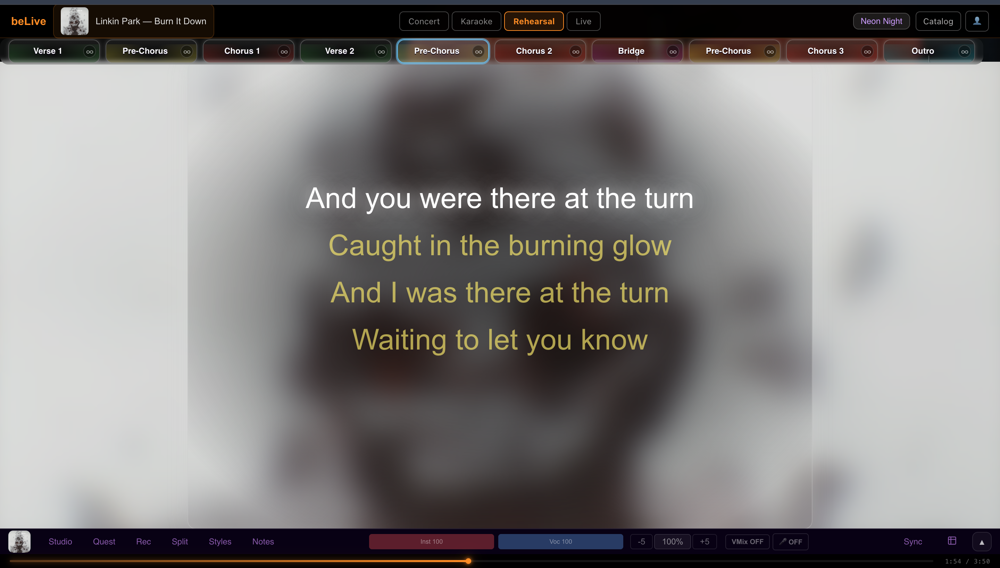 | 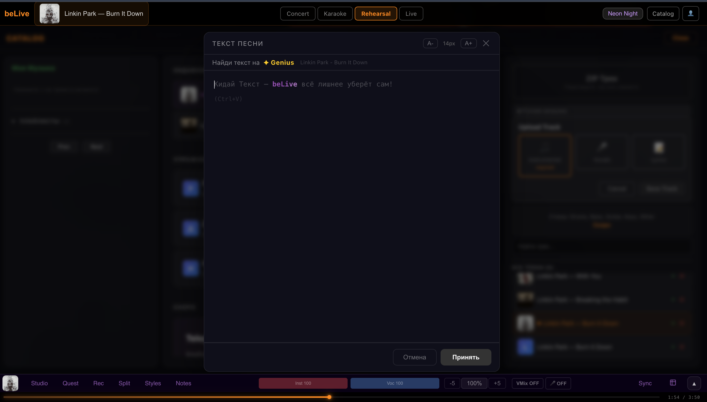 |

| Stems mixer | Visual stems — live waveforms |
|---|---|
| 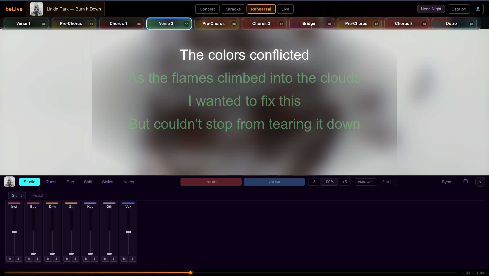 | 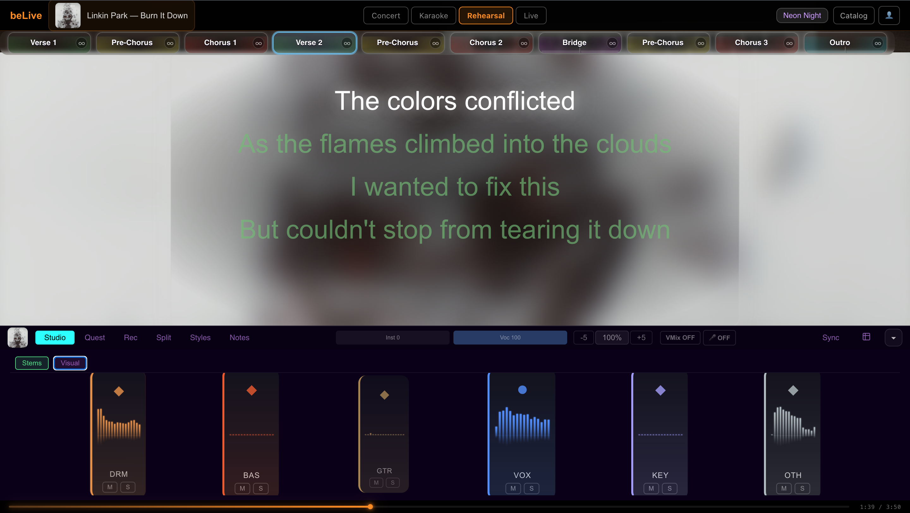 |

| Visual stems — solo mode | Split view |
|---|---|
| 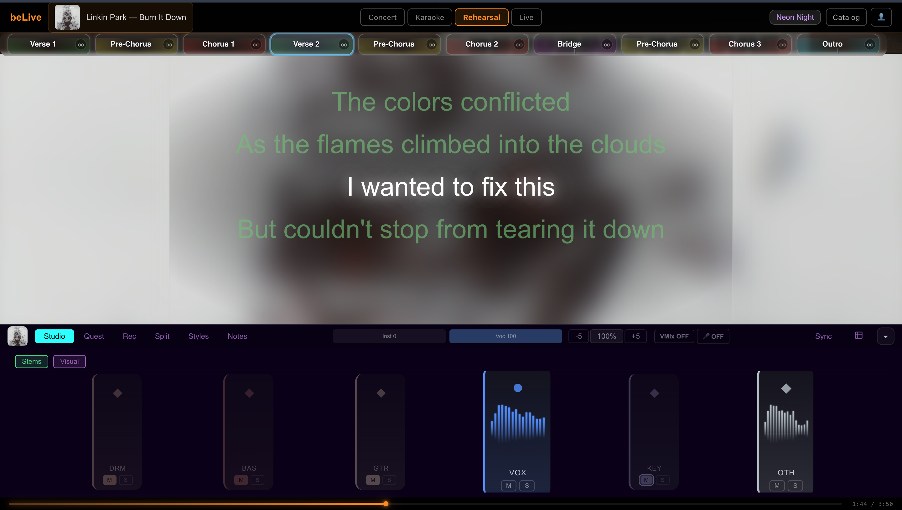 | 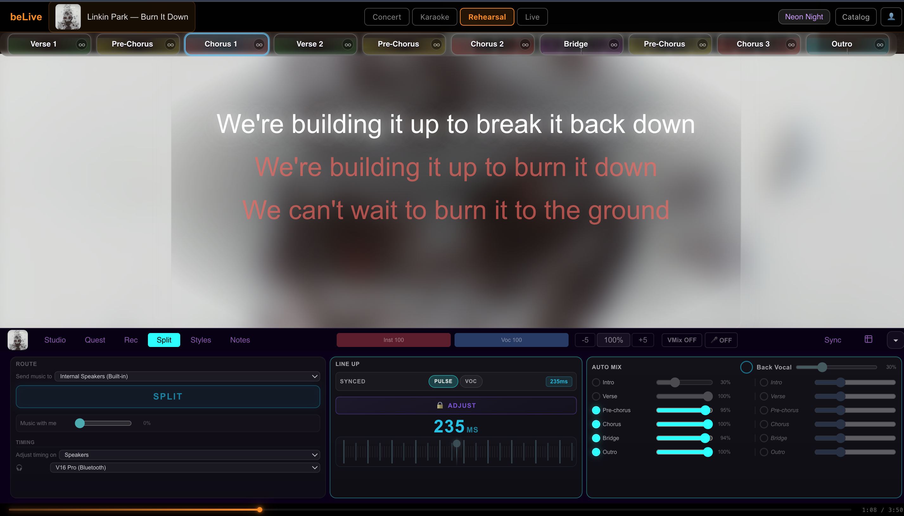 |

| Styles | Notes |
|---|---|
| 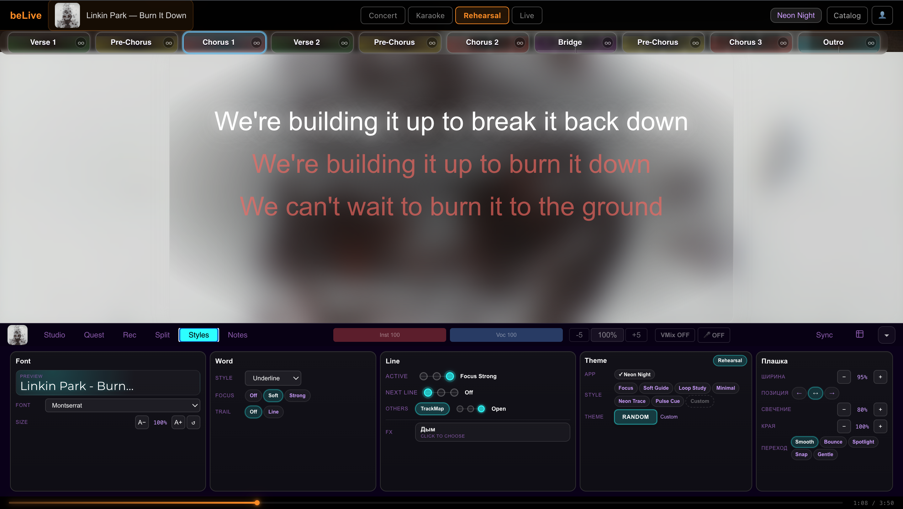 | 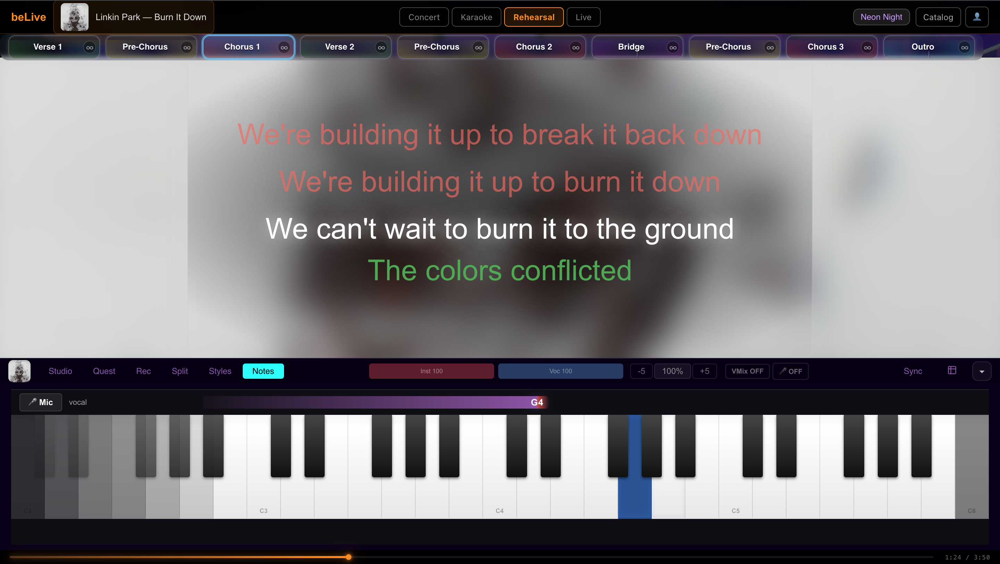 |

| Quest mode | Quest scenario |
|---|---|
| 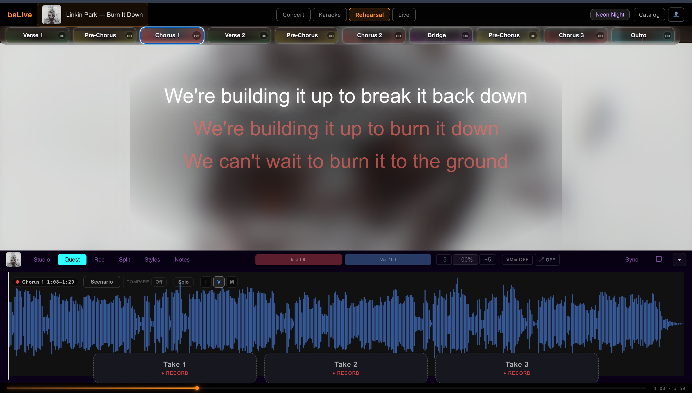 | 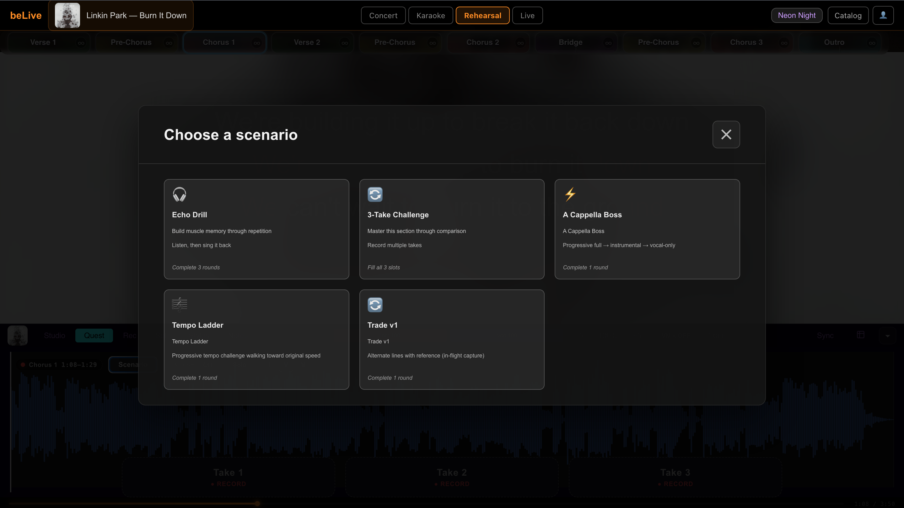 |

| Sync editor | Catalog |
|---|---|
| 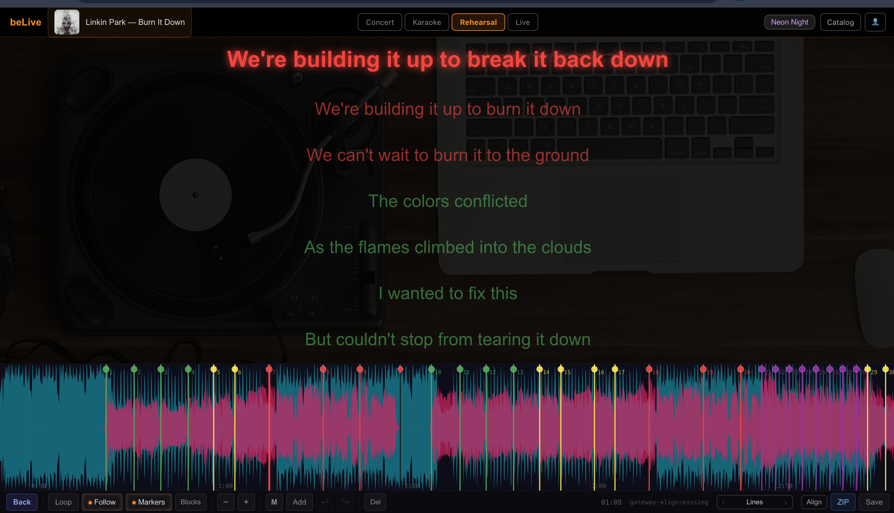 | 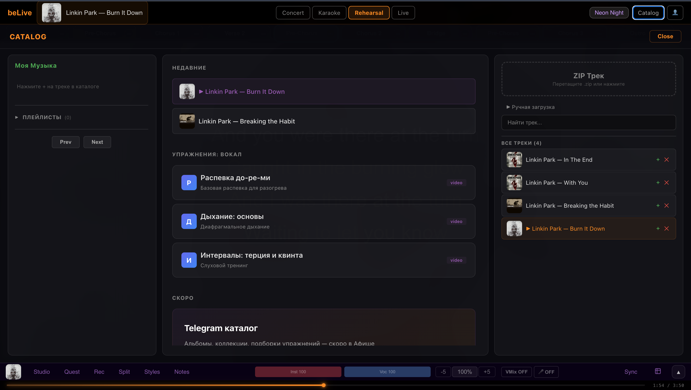 |

---

## Key features

**N-stem audio engine** — progressive loading (instrumental first, stems in background), group buses (master / music / vocal / fx), per-stem mute/solo, live metering with AnalyserNode taps, two-phase loop with gain-mute (Variant F), soft resync via playbackRate correction.

**Synchronized lyrics** — line-level sync via manual marker placement in the Sync Editor. Word-level highlight via Meta MMS forced alignment pipeline. LRC Version Picker fetches and applies LRC from lrclib with one click. Undo/redo, group drag, source mode (mix/instrumental/vocal).

**Block system (TrackMap)** — assign Verse / Chorus / Bridge blocks, navigate by clicking wagons, loop any block or sub-block with one click. Auto-scroll to active block. Tag auto-detection parses `[Verse]` / `[Chorus]` structured lyrics automatically.

**Visual Mixer** — individual faders for Inst / Bass / Drums / Guitar / Keys / Vox. Visual mode shows live waveforms per stem with reactivity profiles and per-role CSS variable pipeline (`--bl-stem-{id}-energy`, `--bl-stem-{id}-hit`).

**Quest system** — 7 vocal exercises: Echo Drill, Repeat×3 Challenge, Call & Response, Backing Only, A Cappella Boss, Tempo Ladder, Trade. Step-based execution (listen → record → compare). Tempo-aware recording, scenario mix override, round capture management.

**Takes** — record practice takes per block, compare waveforms, track progress. Live waveform trail during recording. Tempo-aware take classification (`training` / `final`).

**Split mode / Monitor Mix** — Line Up calibration with CalibrationDrum, pulse/voc source selection, tap-assist timing, device calibration persistence (7-day staleness policy). 4-column panel: Route | Line Up | Auto Mix.

**Style system** — 5 style sections: Font / Word / Line / Theme / Plate. 6 rehearsal recipes (focus, soft-guide, loop-study, minimal, neon-trace, pulse-cue) with weighted random picker. Performance-aware trail depth, mode-specific presets.

**ZIP format** — portable track bundle: audio stems + lyrics + sync markers + cover art + block structure. Functional roundtrip (audio / lyrics / sync / cover preserved; stemsMode and transitionPreset require re-setup after import).

**Cover art** — 3-strategy fetch: iTunes → iTunes title-only → Last.fm fallback. Median cut color extraction (6 buckets, 200px canvas) for UI theming. Offline binary storage in IndexedDB.

**PWA** — installable, works offline after first load (Workbox service worker).

---

## Tech stack

| Layer | Tech |
|---|---|
| UI | React 19 + TypeScript 5.9 |
| Build | Vite 5 + PWA (Workbox) |
| State | Zustand 5 (17+ stores) |
| Audio | Web Audio API — N-stem engine, group buses, progressive loading |
| Persistence | IndexedDB v8 (idb.service) |
| Word sync | Meta MMS via alignment pipeline |
| Testing | Vitest + Playwright |
| Theme | CSS variables on `:root` — no React Context (INV-2.1-THEME) |

---

## Quick start

```bash
git clone https://github.com/side-chaine/beLive.git
cd beLive
npm install
npm run dev
```

Open `http://localhost:5173`.

**Environment variables** (optional — iTunes works without a key):
```bash
cp .env.example .env
# Set VITE_LASTFM_API_KEY for Last.fm cover art fallback
```

```bash
npm test          # run tests
npm run typecheck # TypeScript check
npm run lint      # ESLint
npm run build     # production build → dist/
```

---

## Repo structure

```
src/
├── audio/          # AudioEngineV2 — N-stem transport, buses, progressive loading
├── stem/           # stem.store, stemTypes (StemRole, ROLE_ROUTING, REACTIVITY_PROFILES)
├── bridges/        # 18 bridges — React ↔ legacy boundary fabric
├── components/     # UI: ControlDeck, MixerPanel, WagonTrain, MonitorMixPanel…
├── exercises/      # Quest system — runtime, store, 7 generators
├── performance/    # Performance budget — 6 domains, tier system, recording-safe clamp
├── services/       # IDB, upload, cover art, lyrics, track orchestrator
├── slot-matrix/    # Layout computation — sub-blocks, preview slots, transition presets
├── stores/         # Zustand stores — audio, markers, loop, monitor, deck…
├── sync/           # Sync editor, waveform canvas, word-sync pipeline
├── takes/          # Recording takes — store, recorder, TakesPanel (exercise executor)
├── triggers/       # Word highlight trigger engine (60Hz scheduler)
css/                # Legacy boundary styles
js/                 # Legacy boundary shells
docs/               # Architecture docs, decisions, guides, reference schemas
research/           # MMS alignment workbench and scripts
```

---

## ZIP track format

```
track-name.zip
├── track-name.mp3           # Instrumental stem
├── track-name_vocals.mp3    # Vocal stem (optional)
├── stems/                   # Additional stems: bass, drums, guitar, keys, other
├── lyrics.txt               # Clean lyrics text
├── cover.jpg / cover.png    # Cover art binary (optional)
├── export.json              # Markers + block structure + metadata
└── alignment.json           # Word-sync alignment (optional)
```

**Functional roundtrip** — audio, lyrics, sync markers, blocks, and cover art survive export → import. Fields not preserved: `stemsMode`, `stemDisplayOrder`, `transitionPreset`, `trackMeta`.

See `docs/architecture/zip-pipeline.md` for full spec.

---

## Architecture docs

Full architecture in `docs/architecture/`. Key docs:

| Doc | Covers |
|-----|--------|
| `architecture-map-2.1.md` | Master system map, bridge topology, ownership matrix |
| `audio-engine.md` | AudioEngineV2, N-stem routing, progressive loading |
| `n-stem-architecture.md` | Stem roles, buses, Visual Mixer reactive pipeline |
| `sync-system.md` | Line sync, word sync, LRC picker, waveform editor |
| `zip-pipeline.md` | Export/import format spec |
| `exercises-system.md` | Quest runtime, recipes, generators |
| `takes-system.md` | Recording and waveform system |
| `monitor-mix-v2.md` | Split mode, Line Up calibration |
| `slot-matrix-system-v2.2.md` | Layout computation, sub-blocks, transition presets |
| `performance-quality-system.md` | Visual budget tiers, recording-safe clamping |

---

## Contributing

See `contributing.md`. Short: fork → new branch → PR. All PRs must be DCO-signed:

```bash
git commit -s -m "your message"
```

---

## License

MIT — see `LICENSE`.

---

## Contact

**Nikita Cheremisinov** — [@side-chaine](https://github.com/side-chaine) — nikitosss007@gmail.com
