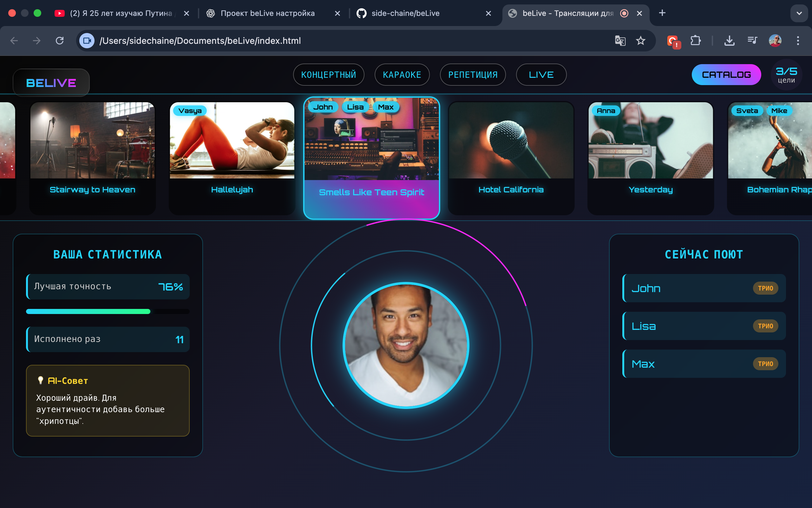

# beLive

**beLive** — an experimental music web app for rehearsal, collaborative performance and visual immersion.

**Short pitch:** beLive helps musicians and music fans practice, tune, and perform songs solo or together — providing advanced audio handling, avatar-driven visual experiences and future AI features.

---

## Elevator pitch
beLive blends a compact studio workflow with a social karaoke experience: solo and group sessions, live avatars and synchronized lyrics, with planned AI-powered recommendations and production tools.

---

## Current status (MVP)
- Web interface and proofs-of-concept (POCs) in `test/` demonstrating avatar/MediaPipe demos and visual effects.
- CI: DCO (Developer Certificate of Origin) check enabled for PRs.
- Automatic deploy to GitHub Pages via GitHub Actions (`.github/workflows/deploy-pages.yml`).
- Branch protection configured: required status checks include DCO and deploy.

---

## Key features (planned / in progress)
- **Karaoke & Rooms:** personal and public rooms with the ability to join live sessions. (Synchronous rooms planned.)
- **Avatar Studio:** interactive room feed — preview performers and tracks; avatars embedded in UI for immersive performance.
- **AI tools (planned):** intelligent recommendations, pitch correction, auto-harmonization and auto-mastering.
- **Real-time (future):** low-latency collaboration via WebRTC / WebSockets.

---

## Screenshots

Here are some visuals of **beLive** in action:

|  |  |  |
|:-----------------------------------------------:|:-----------------------------------------------:|:-----------------------------------------------:|
| Avatar Studio POC                               | Main concert room                                | Concert room, alternative view                    |

|  |  |  |
|:-----------------------------------------------:|:-----------------------------------------------:|:-----------------------------------------------:|
| Karaoke session interface                        | Loop control panel (rehearsal)                  | Pitch adjustment panel (rehearsal)              |

|  |  |
|:-----------------------------------------------:|:-----------------------------------------------:|
| Synchronization panel (rehearsal)               | Main rehearsal view                               |

*All screenshots are POCs and may be updated as development progresses.*

---

## Quick start (local)
1. Open `index.html` in a browser for a quick preview (Pages demo / placeholder). As a purely client-side application, it does not require `npm install` or `npm run dev` at this stage.
2. Try POC demos in `test/` (e.g. `test/live-avatar-poc.html`) — many run without a build system.  
3. If/when a `package.json` is added, follow typical `npm install` / `npm run dev` flow (to be documented).

---

## Repo structure (high-level)
- `index.html` — current Pages entry / placeholder.
- `js/`, `css/` — main application code (JS-heavy).
- `test/` — POCs and demos (useful for visual verification).
- `Karaoke/`, `Rehearsal/`, `img/` — screenshots and design assets.
- `Log/` — runtime logs (should be reviewed and moved if sensitive).

---

## Temporary decisions / notes (important)
- GitHub Pages currently serves a placeholder from `gh-pages` or the deploy workflow. For production we should switch to a CI-built artifact.
- There are big log files and private test artifacts in this repo. Recommended: move logs and sensitive files to a `private-tests` branch or external storage, and add `.gitignore` to prevent new large logs being committed.
- This README is a working version; we'll refine marketing copy and add screenshots after roadmap decisions.

---

## Contributing
See `CONTRIBUTING.md` for contribution guidelines. Short: fork → new branch → PR. All PRs must be DCO-signed (add `Signed-off-by:` or use `--signoff`).

---

## License
This project is licensed under the MIT License — see `LICENSE`.

---

## Contact
Owner / Author: **Nikita Cheremisinov** — GitHub: [@side-chaine](https://github.com/side-chaine) | Email: nikitosss007@gmail.com

---

## Badges

