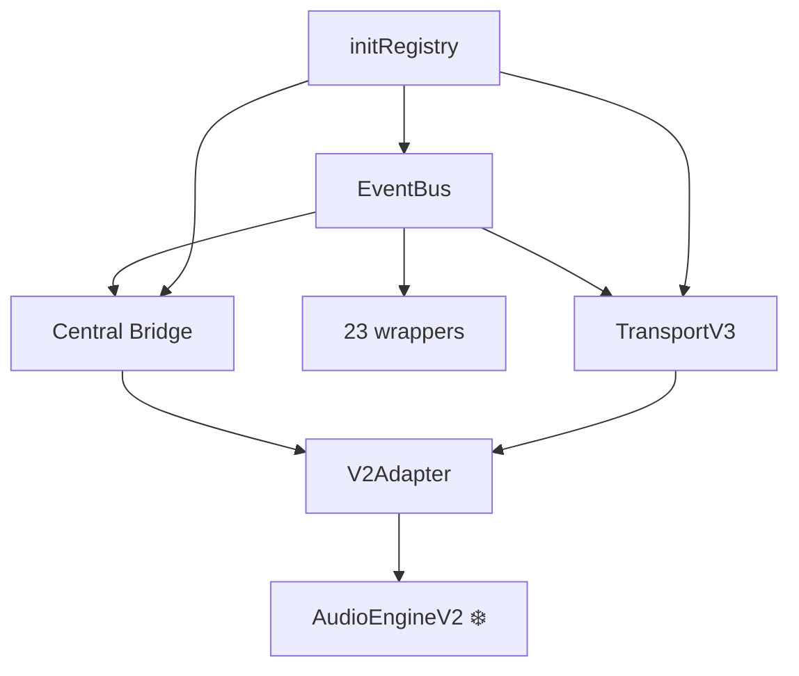

# Архитектурная документация beLive v3

**Дата:** 2026-07-16 | **Автор:** 007_1.1

---

## Документы

| Документ | О чём | Статус |
|:---------|:------|:------:|
| [`eventbus-v2.md`](./eventbus-v2.md) | Центральная шина событий: 6 каналов, 29 событий, Facade | ✅ |
| [`central-bridge.md`](./central-bridge.md) | Store → Engine sync: реактивный слой вместо dual-call | ✅ |
| [`init-registry.md`](./init-registry.md) | Lifecycle: единая инициализация, HMR-safe cleanup | ✅ |
| [`transport-v3.md`](./transport-v3.md) | V3 транспорт: 7 методов, 5 состояний, error recovery | ✅ |
| [`frozen-zones-v2.md`](./frozen-zones-v2.md) | Карта frozen зон: 30 файлов, ~6,932 строк | ✅ |

## Схема зависимостей

## Как читать

1. **EventBus** — фундамент (читать первым)
2. **Central Bridge** — как store связан с engine
3. **initRegistry** — как всё инициализируется
4. **TransportV3** — V3 транспорт
5. **Frozen zones** — что нельзя трогать
