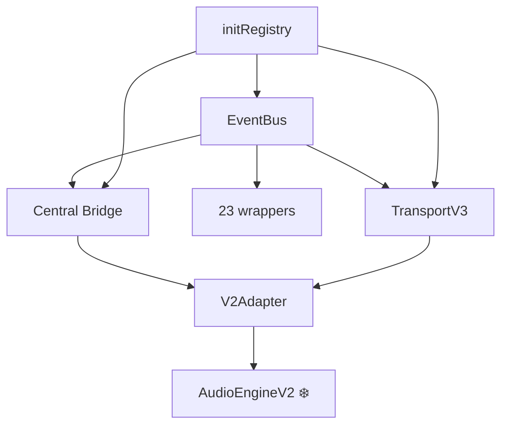

# Архитектурная документация beLive v3

**Дата:** 2026-07-16 | **Автор:** 007_1.1

---

## Документы

| Документ | О чём | Статус |
|:---------|:------|:------:|
| [`eventbus-v2.md`](./eventbus-v2.md) | Центральная шина событий: 6 каналов, 28 событий, Facade | ✅ |
| [`central-bridge.md`](./central-bridge.md) | Store → Engine sync: реактивный слой вместо dual-call | ✅ |
| [`init-registry.md`](./init-registry.md) | Lifecycle: единая инициализация, HMR-safe cleanup | ✅ |
| [`transport-v3.md`](./transport-v3.md) | V3 транспорт: 7 методов, 5 состояний, error recovery | ✅ |
**2 зоны · 17 файлов · ~4 545 строк** (после Волн A+B: patchV1 −162, track.orchestrator −592 снесены; синхронно с frozen-zones-v2.md:3)

## Схема зависимостей

```mermaid
graph TB
    EB[EventBus] --> CB[Central Bridge]
    EB --> WR[23 wrappers]
    CB --> V2A[V2Adapter]
    V2A --> AE[AudioEngineV2 ❄️]
    EB --> TV3[TransportV3]
    TV3 --> V2A
    REG[initRegistry] --> EB
    REG --> CB
    REG --> TV3
```

## Как читать

1. **EventBus** — фундамент (читать первым)
2. **Central Bridge** — как store связан с engine
3. **initRegistry** — как всё инициализируется
4. **TransportV3** — V3 транспорт
5. **Frozen zones** — что нельзя трогать
