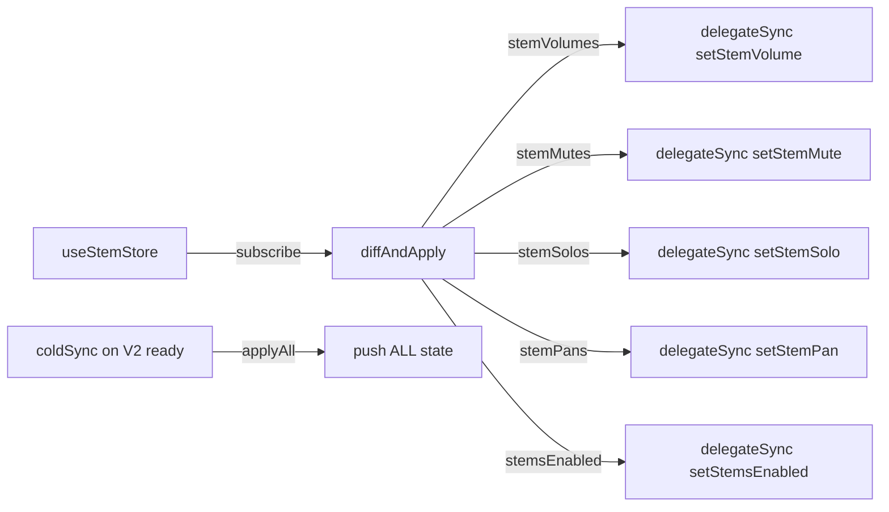

# Central Bridge — Store → Engine Sync
*Описание:* Реактивный слой — подписывается на Zustand store и синхронизирует изменения в audioEngine.
*Дата:* 2026-07-16
*Статус:* ✅ PRODUCTION (активен)

---

## Проблема

`stem.store` имеет инвариант: *"Zero side effects. No audio engine coupling"* (строка 5). Все bridges (frozen) дублируют вызовы: `ae.setStemVolume()` + `store.setStemVolume()`. Если bridge заменить — engine замолчит, потому что store не связан с engine.

## Решение

Central Bridge подписывается на `useStemStore` через Zustand `subscribe()` и при каждом изменении синхронизирует 5 полей в engine через `V2Adapter.delegateSync()`:



## Поток данных

```
UI → useStemStore.setStemVolume(id, vol) → Zustand update
  → Zustand subscribe callback
  → diffAndApply(current, prev) — ручной diff
  → V2Adapter.delegateSync('setStemVolume', id, vol) → AudioEngineV2
```

## Ключевые файлы

| Файл | Назначение |
|------|-----------|
| `src/foundation/reactions/stem-engine-sync.ts` | Central Bridge (164 строки) |
| `src/audio/engine-v3/V2Adapter.ts` | Единственный мост к frozen V2 |
| `__tests__/stem-engine-sync.test.ts` | 6 тестов |

## Особенности

- **Rучной diff** — сравнивает текущее состояние с предыдущим, отправляет только изменения
- **Idempotent** — повторный вызов с тем же значением безопасен
- **Cold-start sync** — при готовности V2 применяет всё состояние сразу
- **Не блокирует frozen bridges** — работает параллельно, bridges продолжают свой dual-call

## Frozen status

| Файл | Статус |
|------|:------:|
| `src/foundation/reactions/*` | ✅ НЕ frozen |
| `src/bridges/*` | ❄️ FROZEN — не трогать, dual-call остаётся |
