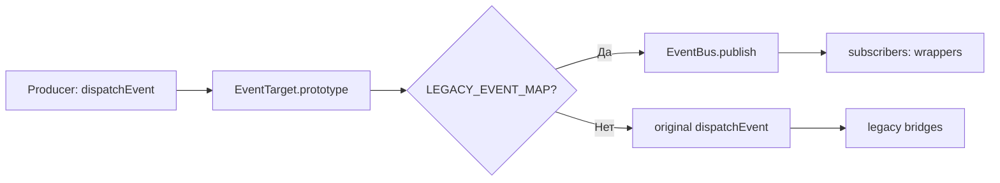

# EventBus v2 — Центральная шина событий
*Описание:* Единая типизированная шина вместо 24 legacy bridges. 6 каналов, 29 событий.
*Дата:* 2026-07-16
*Статус:* ✅ PRODUCTION (Facade dual-delivery)

---

## Архитектура



**Dual-delivery:** событие идёт И в EventBus (для wrapper'ов), И в оригинальный dispatch (для bridges). Bridges продолжают работать, пока не заменены.

## Каналы и события

| Канал | Событий | Ключевые события |
|:-----:|:-------:|------------------|
| Audio | 10 | track-loaded, playback-state-changed, seek-position-changed, track-stem-ready |
| Track | 2 | before-change, load-failed |
| Catalog | 4 | track-saved, tracks-changed, catalog-close, catalog-cleared |
| Sync | 8 | blocks-applied, active-line-changed, loop-set/cleared/completed |
| UI | 3 | mode-changed, block-scenes-loaded, camera-permission-resolved |
| Practice | 2 | practice:state-changed (объединяет 6 legacy events) |
| **Total** | **29** | |

## Ключевые файлы

| Файл | Назначение |
|------|-----------|
| `src/foundation/event-bus/event-bus.ts` | Ядро: publish/subscribe/clear |
| `src/foundation/event-bus/types.ts` | 29 типизированных payload'ов |
| `src/foundation/event-bus/facade.ts` | BridgeFacade (EventTarget.prototype patch) |
| `src/foundation/event-bus/channels/*.ts` | 6 typed helpers |
| `src/foundation/event-bus/wrappers/` | 23 EventBus-wrapper'а (1 активен) |

## Пример использования

```typescript
import { eventBus } from '../foundation/event-bus'
import { EventBusChannel } from '../foundation/event-bus/types'

// Подписка
const sub = eventBus.subscribe(EventBusChannel.Audio, 'playback-state-changed', (payload) => {
  console.log('Playback:', payload.isPlaying, payload.currentTime)
})

// Публикация
eventBus.publish(EventBusChannel.Audio, 'playback-state-changed', {
  isPlaying: true, currentTime: 120, duration: 200
})

// Отписка
sub.unsubscribe()
```

## Особенности

- **Dedup:** 50ms окно — если то же событие пришло дважды, второе отбрасывается
- **Error isolation:** ошибка в одном subscriber не ломает остальных
- **Source-tag:** `publish()` принимает опциональный `source?: 'v2' | 'v3'` для dedup между V2 и V3

## Frozen status

| Компонент | Статус |
|-----------|:------:|
| `src/foundation/event-bus/*` | ✅ НЕ frozen |
| `src/bridges/*` | ❄️ FROZEN — не трогать |
