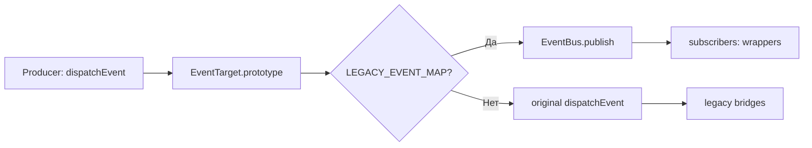

# EventBus v2 — Центральная шина событий
*Описание:* Единая типизированная шина вместо 24 legacy bridges. 6 каналов, 28 событий.
*Дата:* 2026-07-16
*Статус:* ✅ PRODUCTION (Facade dual-delivery)

---

## Архитектура


```mermaid
graph LR
    P[Producer: dispatchEvent] --> EP[EventTarget.prototype]
    EP --> L{LEGACY_EVENT_MAP?}
    L -->|Да| EB[EventBus.publish]
    L -->|Нет| OD[original dispatchEvent]
    EB --> S[subscribers: wrappers]
    OD --> B[legacy bridges]
```

**Dual-delivery:** событие идёт И в EventBus (для wrapper'ов), И в оригинальный dispatch (для bridges). Bridges продолжают работать, пока не заменены.

## Каналы и события

| Канал | Событий | Ключевые события |
|:-----:|:-------:|------------------|
| Audio | 10 | track-loaded, playback-state-changed, seek-position-changed, track-stem-ready |
| Track | 2 | before-change, load-failed |
| Catalog | 4 | track-saved, tracks-changed, catalog-close, catalog-cleared |
| Sync | 8 | blocks-applied, active-line-changed, loop-set/cleared/completed |
| UI | 3 | mode-changed, block-scenes-loaded, camera-permission-resolved |
| Practice | 1 | practice:state-changed (объединяет 6 legacy events) |
| **Total** | **28** | |

## Ключевые файлы

| Файл | Назначение |
|------|-----------|
| `src/foundation/event-bus/event-bus.ts` | Ядро: publish/subscribe/clear |
| `src/foundation/event-bus/types.ts` | 28 типизированных payload'ов |
| `src/foundation/event-bus/facade.ts` | BridgeFacade (EventTarget.prototype patch) |
| `src/foundation/event-bus/channels/*.ts` | 6 typed helpers |
| `src/foundation/event-bus/wrappers/` | EventBus-wrapper'а (~19 в активном использовании) |

## Пример использования

```typescript
import { eventBus } from '../foundation/event-bus'
import { EventBusChannel } from '../foundation/event-bus/types'

// Подписка
const sub = eventBus.subscribe(EventBusChannel.Audio, 'playback-state-changed', (payload) => {
  console.log('Playback:', payload.isPlaying, payload.currentTime)
})

// Публикация
eventBus.publish(EventBusChannel.Audio, 'playback-state-changed', {
  isPlaying: true, currentTime: 120, duration: 200
})

// Отписка
sub.unsubscribe()
```

## Особенности

- **Dedup:** 50ms окно — если то же событие пришло дважды, второе отбрасывается
- **Error isolation:** ошибка в одном subscriber не ломает остальных
- **Source-tag:** `publish()` принимает опциональный `source?: 'v2' | 'v3'` для dedup между V2 и V3

## Вне-шинные каналы (эра V2-наследия) — догон инвентаря
> Источник: 003_2 PB-2/PB-4 (OFFSHOOT-EVENTS-MAP, зонд на `3bdcc06`), верификация 003 (сироты 5/5 sed, aiHub-канал registry.ts:27/:51/:71). Корректирует census-003: «~14 вне-шинных» было **недооценкой — факт 31 имя / 40 эмиттеров / ~20 файлов**.

**Четыре эвент-канала приложения:** ① шина EventBus — 28 типизированных событий (единственный «гражданин») · ② document CustomEvent — 31 имя вне шины (наследие мостовой эры) · ③ window-мосты (beLiveSwitchMode, trackCatalog…) · ④ **aiHub EventTarget** (`modelChanged` registry.ts:27/:51 → слушатели main.tsx:740, ai-chat-ui:177, model-dropdown-ui:31; `assistant.response.completed` :115).

**Сироты document-канала (эмиттер жив, слушателей 0; 10 имён, modelChanged исключён — жив на канале ④):**
- *legacy-хвосты эры мостов:* `mode-changed` · `lyrics-rendered` · `blocks-applied` · `catalog-cleared` · `loop-set` · `loop-cleared` · `vocalmix-state-changed` · `microphone-state-changed` — кандидаты в инвентарь Д-2 (эмиттеры в js-эре; судьба кода — цепь/007, не док)
- *диагностика-в-никуда:* `track-load-failed` (track.loader) · `taxonomy-seek-mismatch` · `belive:v3-activation-failed` (V3DataInterceptor) — эмиттеры осознанны, обсерверов нет; кандидат: подписать на logger (класс BAC-109) — решение цепи

**Каналы-гиганты и двойники:** `tracks-changed` — 14 эмиттеров (track.actions×1, upload.service×5, BlockScenesModal×7, CatalogLayout×1) при 1 слушателе (useBackgroundManagers) — семантическая дивергенция одного имени, шов для MO-catalog/track dossier (004) · `active-line-changed` — двойной канал (document из lyrics.service + шина через lyrics-events wrapper) — риск рассинхрона RehearsalBackground; wrapper-слой (README:50 «перехватчик legacy») перехватывает не всё — 31 имя вне шины тому доказательство.

## Frozen status

| Компонент | Статус |
|-----------|:------:|
| `src/foundation/event-bus/*` | ✅ НЕ frozen |
| `src/bridges/*` | 🗑 удалён (волны C/D 09-10.09: 15 мостов + live-guard; манифест заморожен D-3) |
