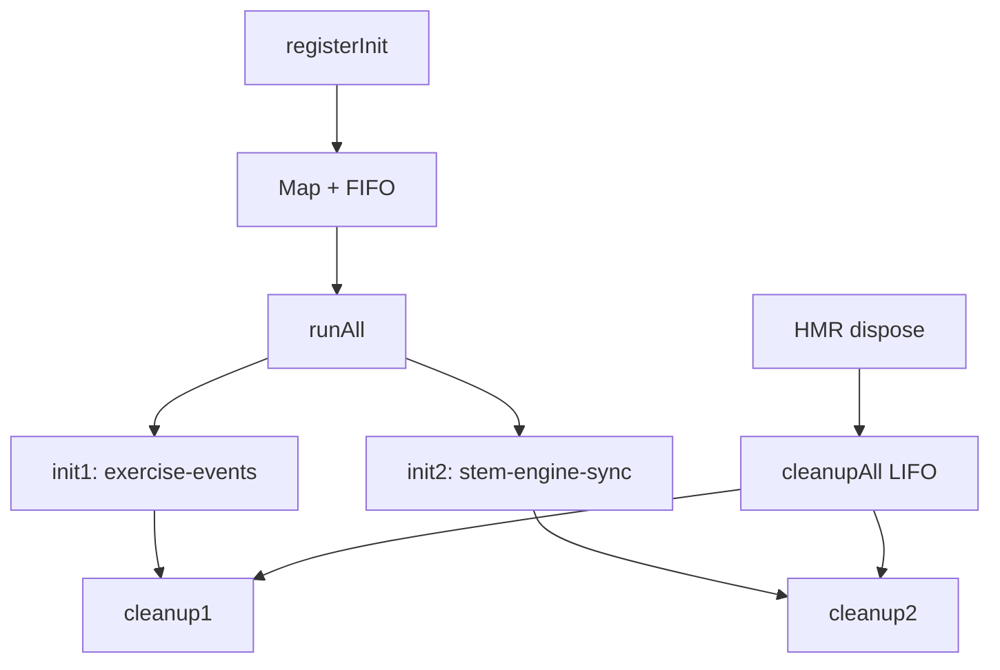

# initRegistry — Система жизненного цикла
*Описание:* Единый lifecycle для инициализации и cleanup всех модулей. HMR-safe.
*Дата:* 2026-07-16
*Статус:* ✅ PRODUCTION

---

## Проблема

Раньше каждый модуль вручную инициализировался в `main.tsx` и `App.tsx` — 20+ раскиданных вызовов. При HMR (hot-reload) cleanuр не вызывался — singleton'ы и listeners висели мёртвым грузом.

## Решение

initRegistry — единый реестр init-функций:

```typescript
registerInit('id', { init: () => cleanup }) // регистрация
runAll() → cleanupAll()                       // запуск/остановка
```



## Ключевые файлы

| Файл | Назначение |
|------|-----------|
| `src/foundation/registry/initRegistry.ts` | Реестр (104 строки) |
| `src/foundation/registry/__tests__/initRegistry.test.ts` | Тесты lifecycle |

## Пример использования

```typescript
import { registerInit, runAll } from '../foundation/registry/initRegistry'

registerInit('exercise-events', {
  init: () => {
    const cleanup = initExerciseEvents()
    return () => {
      cleanup()
      console.log('[initRegistry] exercise-events cleanup')
    }
  }
})

// В main.tsx:
const cleanupAll = runAll()

// HMR auto-cleanup:
import.meta.hot?.dispose(() => {
  cleanupAll()
  bridgeFacade.destroy()
})
```

## Frozen status

| Компонент | Статус |
|-----------|:------:|
| `src/foundation/registry/*` | ✅ НЕ frozen |
| `src/bridges/*` | ❄️ FROZEN — не регистрировать, не трогать |
