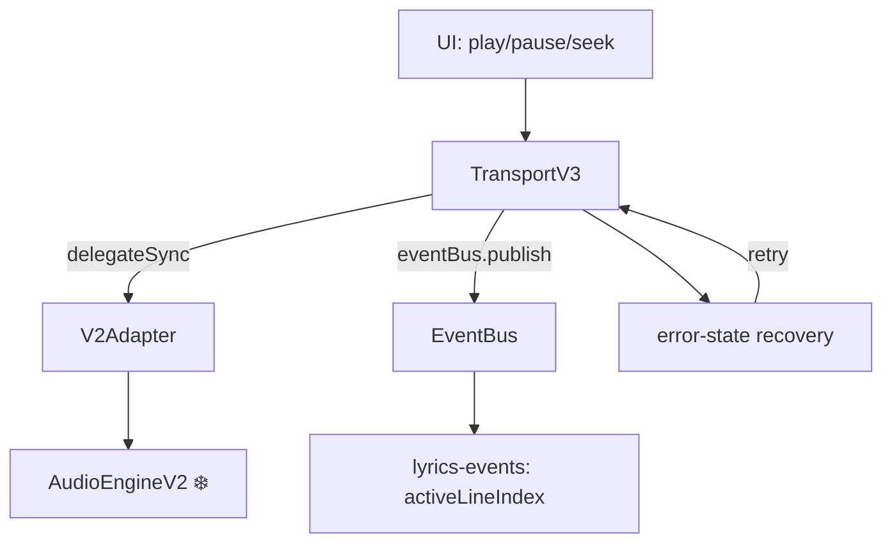

# TransportV3 — Аудио-транспорт
*Описание:* V3 транспорт — синглтон с 5 состояниями, error recovery и EventBus интеграцией.
*Дата:* 2026-07-16
*Статус:* ✅ PRODUCTION (как прослойка над V2, своего AudioContext нет)

---

## Архитектура



7 публичных методов, 4 геттера, 5 состояний:

```
IDLE → PLAYING → PAUSED → (seek) → PLAYING
                        → ERROR → (recover) → IDLE/PLAYING
```

## Ключевые файлы

| Файл | Назначение |
|------|-----------|
| `src/audio/engine-v3/TransportV3.ts` | Транспорт (123 строки) |
| `src/audio/engine-v3/V2Adapter.ts` | Мост к V2 |
| `src/audio/engine-v3/types.ts` | Типы: состояния, события |

## Пример использования

```typescript
import { getTransport } from '../audio/engine-v3'

const transport = getTransport()
await transport.init()

await transport.play()       // post-verify: проверяет _isPlaying после play
transport.pause()
await transport.seek(120)    // публикует seek-position-changed в EventBus

// Геттеры:
transport.isPlaying       // boolean
transport.currentTime     // number
transport.duration        // number
transport.state           // 'idle' | 'playing' | 'paused' | 'error'
```

## Особенности

- **Error-state recovery:** при ошибке переходит в `ERROR`, retry через `recover()`
- **Post-verify play:** после `play()` проверяет что `_isPlaying === true`, иначе retry
- **EventBus интеграция:** `seek()` публикует `seek-position-changed` для lyrics sync
- **Singleton:** `getTransport()` — всегда один инстанс

## Текущие ограничения

- V3 не имеет своего AudioContext — 100% делегирует в V2 через V2Adapter
- `_v2Fallback = true` навсегда, пока не появится V3 AudioContext

## Frozen status

| Файл | Статус |
|------|:------:|
| `src/audio/engine-v3/*` | ✅ НЕ frozen |
| `src/audio/core/AudioEngineV2.ts` | ❄️ FROZEN — V2Adapter только читает |
| `src/audio/compat/patchV1.ts` | ❄️ FROZEN |
