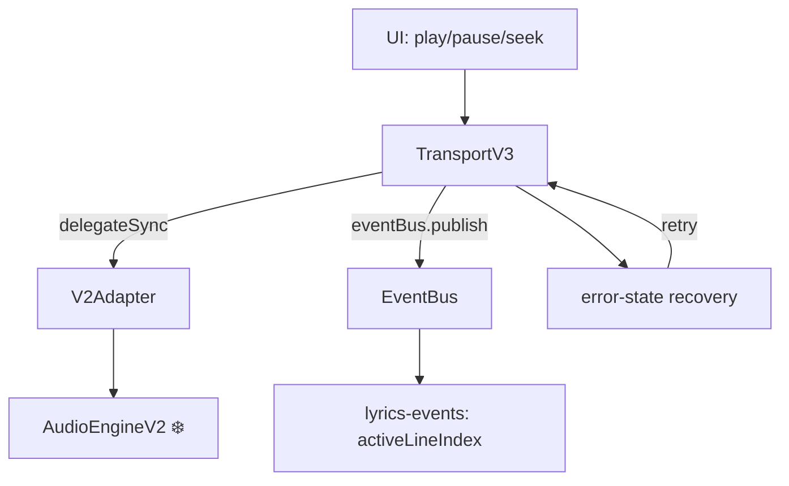

# TransportV3 — Аудио-транспорт
*Описание:* V3 транспорт — синглтон с 5 состояниями, error recovery и EventBus интеграцией.
*Дата:* 2026-07-17 (обновлён: V3 — полноценный engine, не прослойка)
*Статус:* ✅ PRODUCTION (15 модулей engine-v3/, V2Adapter как fallback для frozen)

---

## Архитектура


```mermaid
graph TD
    A[UI: play/pause/seek] --> B[TransportV3]
    B -->|delegateSync| C[V2Adapter]
    C --> D[AudioEngineV2 ❄️]
    B -->|eventBus.publish| E[EventBus]
    E --> F[lyrics-events: activeLineIndex]
    B --> G[error-state recovery]
    G -->|retry| B
```

7 публичных методов, 4 геттера, 5 состояний:

```
IDLE → PLAYING → PAUSED → (seek) → PLAYING
                        → ERROR → (recover) → IDLE/PLAYING
```

## EngineV3 — состав (15 модулей)

```
src/audio/engine-v3/
├── TransportV3.ts        (5,042 строк) — транспорт, 5 состояний
├── V2Adapter.ts          (2,631 строк) — мост к V2 (единственный bridge к frozen)
├── StemPlayerV3.ts       (1,546)       — загрузка и управление стемами
├── VocalMixV3.ts         (1,100)       — вокальный микс (bypass, level)
├── MicrophoneV3.ts       (1,583)       — микрофон (input, monitor)
├── LoopEngineV3.ts       (1,266)       — loop подсистема
├── CrossfadeV3.ts        (1,186)       — кроссфейд между треками
├── CaptureBusV3.ts       (1,304)       — Program Capture Bus (запись выхода)
├── DuckGuardV3.ts        (2,989)       — защита от обратной связи
├── MeterNodeV3.ts        (1,461)       — Web Audio meter
├── RateParamV3.ts        (999)         — rate parameter smoothing
├── IV2PublicContract.ts  (3,002)       — V2 public API контракт
├── index.ts              (1,242)       — getTransport() singleton
├── types.ts              (777)         — типы
└── __tests__/            3 тест-файла
```

## Ключевые файлы

| Файл | Назначение |
|------|-----------|
| `src/audio/engine-v3/core/TransportV3.ts` | Транспорт (5,042 строки, 5 состояний) |
| `src/audio/engine-v3/V2Adapter.ts` | Мост к V2 (IV2PublicContract, allowlist, `_` blocked) |
| `src/audio/engine-v3/core/types.ts` | Типы: состояния, события |

## Пример использования

```typescript
import { getTransport } from '../audio/engine-v3'

const transport = getTransport()
await transport.init()

await transport.play()       // post-verify: проверяет _isPlaying после play
transport.pause()
await transport.seek(120)    // публикует seek-position-changed в EventBus

// Геттеры:
transport.isPlaying       // boolean
transport.currentTime     // number
transport.duration        // number
transport.state           // 'idle' | 'playing' | 'paused' | 'error'
```

## Особенности

- **Error-state recovery:** при ошибке переходит в `ERROR`, retry через `recover()`
- **Post-verify play:** после `play()` проверяет что `_isPlaying === true`, иначе retry
- **EventBus интеграция:** `seek()` публикует `seek-position-changed` для lyrics sync
- **Singleton:** `getTransport()` — всегда один инстанс

## Текущие ограничения

- V3 имеет собственные модули (StemPlayerV3, LoopEngineV3, VocalMixV3, MicrophoneV3, CaptureBusV3 и др.), но AudioContext — единый (V2 через V2Adapter)
- V2Adapter — единственный мост к frozen AudioEngineV2, через IV2PublicContract
- scheduler (rAF) — через Scheduler Orchestrator (acquire/release lifecycle)
- `_v2Fallback` — механизм fallback для методов, не реализованных в V3

## Frozen status

| Файл | Статус |
|------|:------:|
| `src/audio/engine-v3/*` | ✅ НЕ frozen |
| `src/audio/core/AudioEngineV2.ts` | ❄️ FROZEN — V2Adapter только читает |
| `src/audio/compat/patchV1.ts` | ❄️ FROZEN |
