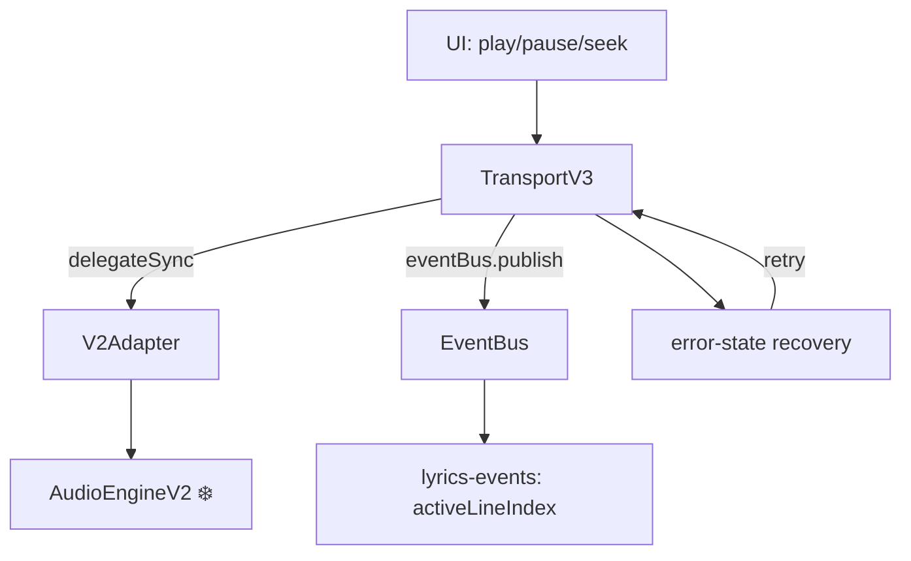

# TransportV3 — Аудио-транспорт
*Описание:* V3 транспорт — синглтон с 5 состояниями, error recovery и EventBus интеграцией.
*Дата:* 2026-07-17 (обновлён: V3 — полноценный engine, не прослойка)
*Статус:* ✅ PRODUCTION (30 модулей в 8 слоях engine-v3/, V2Adapter — мост к frozen V2)

---

## Архитектура


```mermaid
graph TD
    A[UI: play/pause/seek] --> B[TransportV3]
    B -->|delegateSync| C[V2Adapter]
    C --> D[AudioEngineV2 ❄️]
    B -->|eventBus.publish| E[EventBus]
    E --> F[lyrics-events: activeLineIndex]
    B --> G[error-state recovery]
    G -->|retry| B
```

7 публичных методов, 4 геттера, 5 состояний:

```
IDLE → PLAYING → PAUSED → (seek) → PLAYING
                        → ERROR → (recover) → IDLE/PLAYING
```

## Ключевые файлы

| Файл | Назначение |
|------|-----------|
| `src/audio/engine-v3/core/TransportV3.ts` | Транспорт (5,042 строки, 5 состояний) |
| `src/audio/engine-v3/V2Adapter.ts` | Мост к V2 (IV2PublicContract, allowlist, `_` blocked) |
| `src/audio/engine-v3/core/types.ts` | Типы: состояния, события |

## Пример использования

```typescript
import { getTransport } from '../audio/engine-v3'

const transport = getTransport()
await transport.init()

await transport.play()       // post-verify: проверяет _isPlaying после play
transport.pause()
await transport.seek(120)    // публикует seek-position-changed в EventBus

// Геттеры:
transport.isPlaying       // boolean
transport.currentTime     // number
transport.duration        // number
transport.state           // 'idle' | 'playing' | 'paused' | 'error'
```

## Особенности

- **Error-state recovery:** при ошибке переходит в `ERROR`, retry через `recover()`
- **Post-verify play:** после `play()` проверяет что `_isPlaying === true`, иначе retry
- **EventBus интеграция:** `seek()` публикует `seek-position-changed` для lyrics sync
- **Singleton:** `getTransport()` — всегда один инстанс

## EngineV3 — состав (8 слоёв · 30 модулей · ~4 900 строк)

```
src/audio/engine-v3/           # 30 prod .ts/.tsx · 4914 LOC (+10 тест-файлов · 1817 LOC)
├── core/        4 файла 635   # TransportV3 317 · HybridClock 176 · StemOrchestrator 134 · types 8
├── pipeline/    6 файлов 1509 # HybridPipelineService 745 · StretchInstancePool 279 · StretchInstance 221
│                            #   StemChain 152 · IPipelineController 73 · HybridLoopStrategy 39
├── monitor/     5 файлов 893  # MonitorEngine 285 · MonitorRouter 283 · AutoMixController 120
│                            #   PulseCalibrator 114 · DeviceManager 91
├── integration/ 6 файлов 691  # V3DataInterceptor 250 · V3StatePublisher 202 · LoopEngineV3 88
│                            #   DuckGuardV3Native 66 · AudioCrashModal 64 · useAudioContextHealth 21
├── stems/       1 файл 344   # StemPlayerV3
├── services/    2 файла 164  # MicSourceV3 95 · RateThrottler 69
├── diagnostics/ 2 файла 390  # CaptureWorklet 264 · DuplicateAudioRouteChecker 126
└── корень       4 файла 288  # index 59 (getTransport) · V2Adapter 83 · IV2PublicContract 115 · vendor .d.ts
```
> Счёт = production .ts/.tsx. Диагностический harness (~20 файлов .mjs/.json в diagnostics/) и тесты в счёт модулей не входят.
> Перенос имён (истор.): TransportV3→core/ · types→core/ · StemPlayerV3→stems/ · LoopEngineV3→integration/ · DuckGuardV3→integration/DuckGuardV3Native (замена) · V2Adapter, IV2PublicContract, index — корень.

| Файл | Статус |
|------|:------:|
| `src/audio/engine-v3/*` | ✅ НЕ frozen |
| `src/audio/core/AudioEngineV2.ts` | ❄️ FROZEN — V2Adapter только читает |
| `src/audio/compat/patchV1.ts` | 🗑️ удалён 01.09, Волна A (мёртвый экспорт; памятник — frozen-manifest.json история) |
